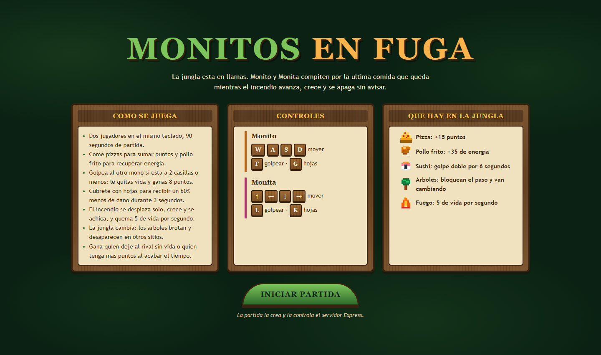
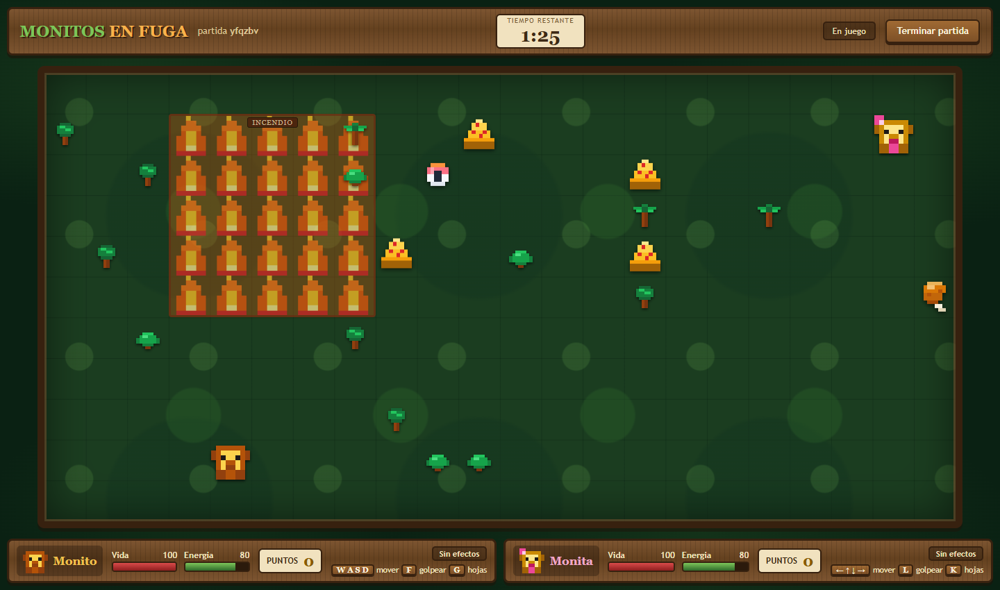
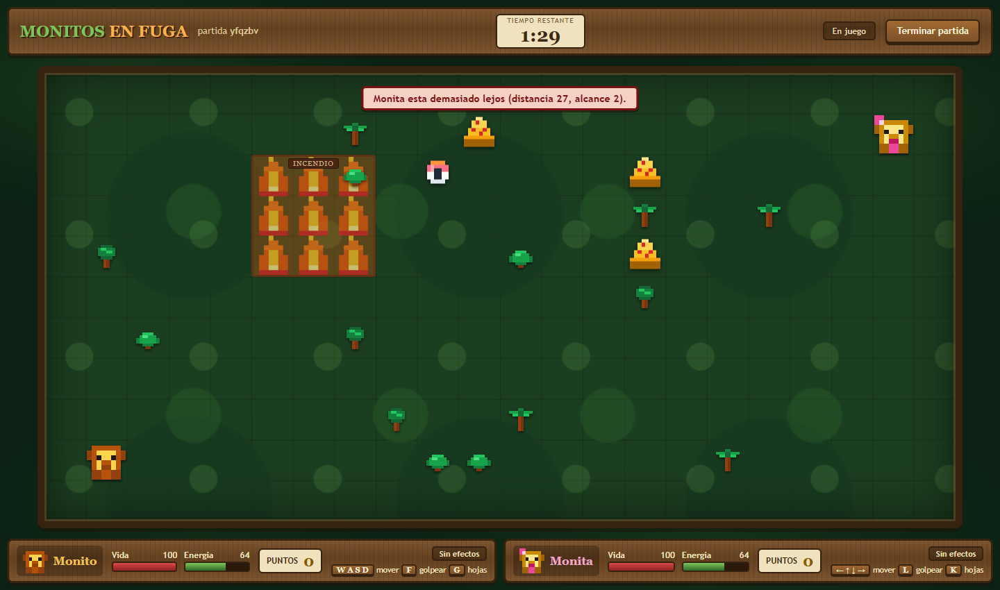
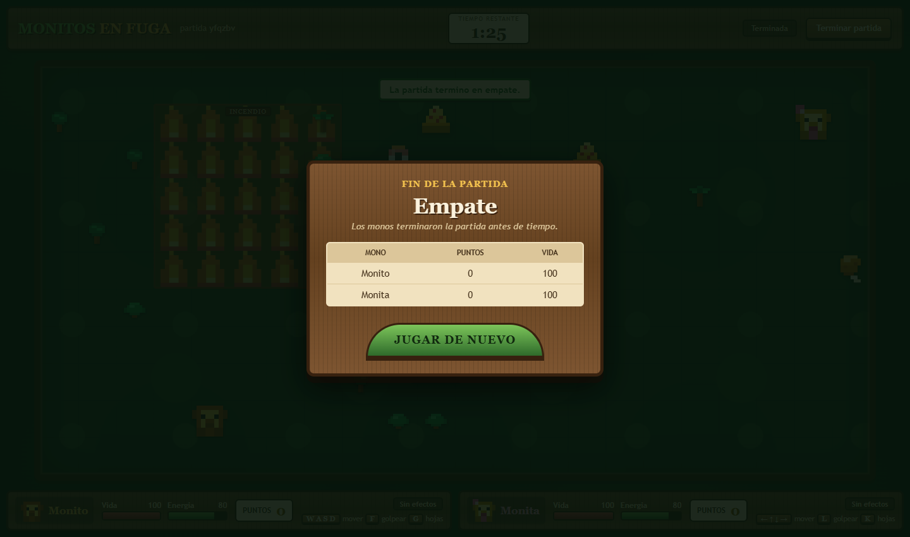

# Introduccion al proyecto

## Nombre del juego

**Monitos en Fuga**

## De que trata

La jungla se esta quemando. Dos monos, **Monito** y **Monita**, quedaron atrapados dentro y compiten
por la ultima comida que queda mientras el incendio avanza, crece y se apaga sin avisar. Los dos
tienen que escapar del fuego mientras pelean entre ellos: de ahi el nombre del juego.

La partida dura **90 segundos** y se juega **entre dos personas en el mismo teclado**.

## Proposito del proyecto

El objetivo academico es mostrar el flujo completo de una aplicacion web:

1. el jugador realiza una accion (una tecla);
2. React envia esa accion al backend con `fetch`;
3. Express valida la accion, cambia el estado de la partida y devuelve el nuevo estado en JSON;
4. React vuelve a dibujar la jungla con ese estado.

Por eso el servidor no es un simple almacen de puntajes: es quien decide si una accion es valida,
cuanto dano hace un golpe, donde aparece la comida, por donde va el incendio y quien gana.

## Experiencia de juego que propone

- **Tension constante:** el incendio se mueve rapido (cada 0.8 segundos) y ademas cambia de tamano,
  asi que ningun rincon es seguro para siempre. No se puede esperar quieto a que acabe el tiempo.
- **Dos formas de ganar:** comer pizzas para sumar puntos o buscar la pelea directa. Cada golpe
  acertado tambien da puntos, asi que atacar es una estrategia valida, pero gasta energia y obliga a
  acercarse al rival.
- **Decisiones cortas y repetidas:** en cada momento el jugador elige entre ir por una pizza, ir por
  pollo frito, arriesgarse por el sushi, perseguir al otro mono, cubrirse con hojas o huir del fuego.

## Cantidad y tipo de jugadores

- **Dos jugadores humanos**, en el mismo dispositivo y en la misma pantalla.
- No hay turnos: los dos juegan al mismo tiempo, cada uno con su parte del teclado.
- No hay jugador controlado por la maquina; el rival siempre es la otra persona. Lo que si controla el
  servidor es el "tercer elemento" de la partida: el incendio y la aparicion de comida.

| | Monito (Jugador 1) | Monita (Jugadora 2) |
|---|---|---|
| Color | Ambar | Rosa |
| Mover | `W` `A` `S` `D` | Flechas |
| Golpear | `F` | `L` |
| Cubrirse con hojas | `G` | `K` |
| Posicion inicial | Abajo a la izquierda | Arriba a la derecha |

## Que observa y que hace el usuario

Al entrar ve la **pantalla de inicio** con el nombre del juego, las reglas resumidas, los controles de
ambos monos, lo que puede encontrar en la jungla y el boton *Iniciar partida*.

Al pulsar el boton, el navegador pide al servidor que cree una partida y aparece la **pantalla de
juego**, que ocupa toda la ventana:

- barra superior con el titulo, el identificador de la partida, el tiempo restante y el boton
  *Terminar partida*;
- la jungla, que ocupa casi toda la ventana, con los arboles, la comida, el incendio y los dos monos;
- sobre la jungla, un aviso breve con lo ultimo que paso (golpes, comida, quemaduras, acciones
  invalidas), que se oculta solo a los pocos segundos;
- abajo, un panel para Monito y otro para Monita con la vida, la energia, los puntos, los efectos
  activos y sus teclas.

Cuando la partida termina aparece la **pantalla de resultado** encima de la jungla, con el ganador, el
motivo de la finalizacion, los puntos y la vida finales, y un boton para jugar de nuevo.

## Como termina la partida

1. **KO:** un mono llega a 0 de vida. Gana el otro.
2. **Tiempo:** pasan los 90 segundos. Gana quien tenga mas puntos; si empatan, la partida queda en
   empate.
3. **Final anticipado:** los jugadores pulsan *Terminar partida*. Se cierra igual que por tiempo,
   ganando quien tenga mas puntos en ese momento.

## Bocetos de pantalla

El boceto inicial (hecho antes de programar) fue este:

```
+---------------------------------------------------------------+
|  MONITOS EN FUGA   partida abc123   1:30     [Terminar]       |
+---------------------------------------------------------------+
|             [ Monito se comio una pizza (+15) ]               |
|                                                               |
|                       J U N G L A                             |
|         (arboles, comida, incendio, los dos monos)            |
|                                                               |
+-------------------------------+-------------------------------+
| MONITO  vida ### energia ##   | MONITA  vida ### energia ##   |
|         puntos 45   teclas    |         puntos 30   teclas    |
+-------------------------------+-------------------------------+
```

El resultado final quedo muy parecido al boceto:





Aviso de una accion invalida (golpear desde demasiado lejos), mostrado sobre la jungla:





## Documentos relacionados

- [reglas.md](reglas.md): reglas completas, estados e interaccion entre jugadores.
- [api.md](api.md): diseno de la API REST con ejemplos.
- [decisiones.md](decisiones.md): decisiones tecnicas, riesgos y cambios durante el desarrollo.
- [investigacion.md](investigacion.md): pruebas E2E y publicacion.
- [uso-ia.md](uso-ia.md): registro del uso de inteligencia artificial.
- [verificacion-requisitos.md](verificacion-requisitos.md): revision final contra el enunciado.
